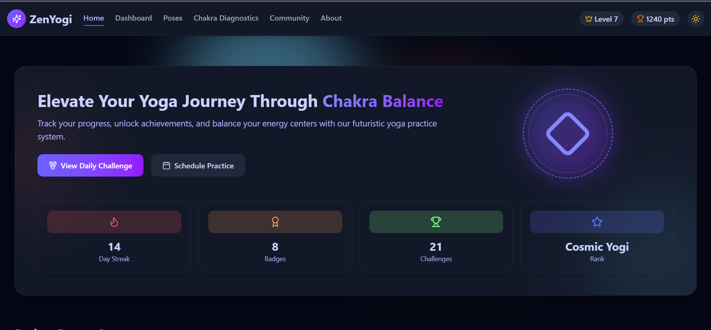
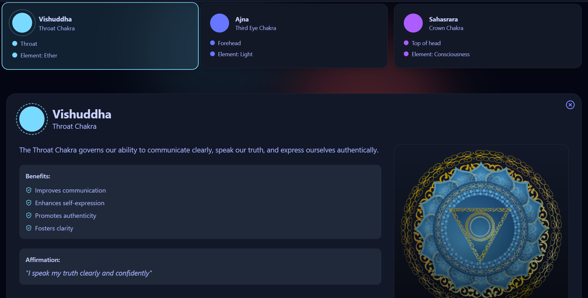
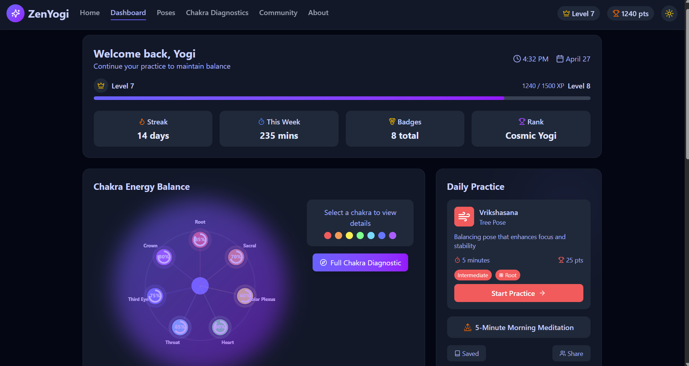
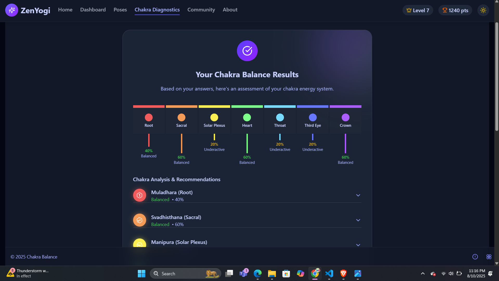
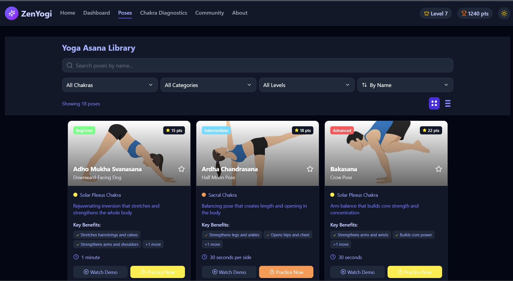
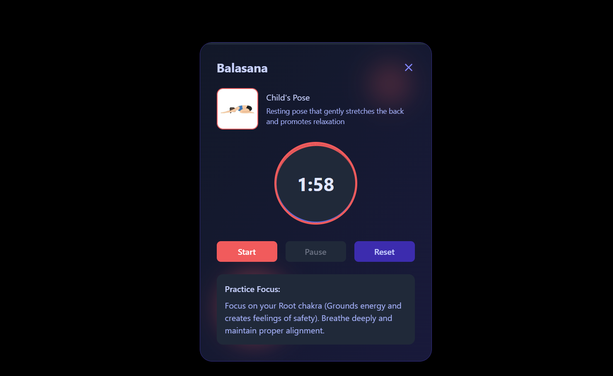

# 🧘‍♀️ ZenYoga – Chakra Balancing App


ZenYoga is a modern web application built with **React** and **Vite** that helps users understand, track, and balance their **7 chakras** through guided exercises, yoga poses, and meditation techniques.  
It offers a clean, responsive, and interactive experience for users seeking mental, physical, and spiritual well-being.

---

## 📌 Problem Statement
In today’s fast-paced world, people face high stress, emotional instability, and poor lifestyle habits.  
Ancient traditions describe **7 chakras**—energy centers in the human body that directly impact our mental, emotional, and physical health.  
When these chakras are blocked or imbalanced, it can lead to anxiety, fatigue, and loss of focus.

---

## 💡 Solution
ZenYoga provides an easy-to-use digital platform that guides users through **yoga poses, breathing exercises, and meditations** designed to **balance each of the 7 chakras**.  
By combining ancient wisdom with a modern user interface, the app makes holistic wellness accessible for everyone, anywhere.

---

## 🚀 Features
- 🌈 Detailed guides for all **7 chakras**
- 🧘 Yoga poses & breathing exercises to restore chakra balance
- 🎧 Guided meditation for relaxation and healing
- 📱 Fully responsive mobile-friendly design
- 🎨 Modern UI with reusable React components
- 📅 Personalized daily chakra balancing routine

---

## 🛠️ Tech Stack
- **Frontend:** React, Vite  
- **Styling:** Tailwind CSS  
- **Routing:** React Router  
- **State Management:** useState / useContext  
- **Icons:** Lucide React / Font Awesome  

---

## 📸 Screenshots

| Home Page | Chakra Detail |
|-----------|---------------|
|  |  |

| DashBoard Page| Diagnosis Page |
|-----------------|------------------------|
|  |  |

| Meditation Page | Yoga Timer Page |
|-----------------|------------------------|
|  |  |

---


## ⚙️ Installation & Running Locally

Follow these steps to run **ZenYoga** on your local machine:

1. **Clone the repository**
   ```bash
   https://github.com/Tejarella/Zentura-react.git
2. **Navigate to the project folder**
   ```bash
   cd Zentura-react-master
3. **Install dependencies**
   ```bash
    npm install
4. **Start the development server**
   ```bash
    npm run dev
5. **Open the app in your browser**
   ```bash
    http://localhost:5173
🔗 Live Demo
https://zenturayoga.netlify.app/
Click here to view the live project

(Deploy easily using Vercel or Netlify)


